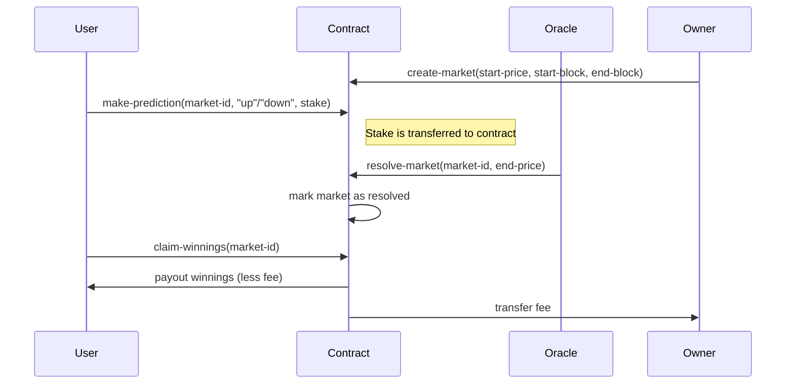

# BitFutures: Decentralized Bitcoin Price Prediction Market

**BitFutures** is a decentralized, non-custodial prediction market built on the Stacks blockchain, enabling users to stake STX by predicting the future movement of Bitcoin prices—whether it will go **up** or **down**. The contract leverages a decentralized oracle to resolve markets and automatically distributes rewards to winning participants, with a fee retained by the contract owner.

---

## 🧩 System Overview

BitFutures allows the creation of time-bound prediction markets where users stake STX on whether the BTC price will increase or decrease over a specified period. Markets are resolved based on data from an oracle, and winnings are proportionally distributed among correct predictors after deducting a protocol fee.

### Key Participants

* **Users**: Place "up" or "down" predictions with STX stakes.
* **Oracle**: Provides closing prices to resolve the markets.
* **Contract Owner**: Manages protocol parameters and collects protocol fees.

---

## ⚙️ Contract Architecture

The smart contract is written in **Clarity**, the smart contract language for the Stacks blockchain, ensuring full transparency and determinism in market resolution and fund distribution.

### Constants

| Constant         | Description                             |
| ---------------- | --------------------------------------- |
| `contract-owner` | Deployer of the contract                |
| `oracle-address` | Address authorized to resolve markets   |
| `minimum-stake`  | Minimum required stake (default: 1 STX) |
| `fee-percentage` | Protocol fee on winnings (default: 2%)  |

---

### Key Data Structures

#### `markets` (Map)

Stores the prediction market details indexed by `market-id`.

```clojure
{
  start-price: uint,
  end-price: uint,
  total-up-stake: uint,
  total-down-stake: uint,
  start-block: uint,
  end-block: uint,
  resolved: bool
}
```

#### `user-predictions` (Map)

Stores each user’s prediction for a given market.

```clojure
{
  prediction: "up" or "down",
  stake: uint,
  claimed: bool
}
```

---

## 📊 Data Flow (Prediction Lifecycle)



---

## 📌 Public Functions

### Market Management

* `create-market(start-price, start-block, end-block)`
* `resolve-market(market-id, end-price)` – only callable by oracle

### User Interaction

* `make-prediction(market-id, prediction, stake)`
* `claim-winnings(market-id)`

### Read-Only Queries

* `get-market(market-id)`
* `get-user-prediction(market-id, user)`
* `get-contract-balance()`

---

## 🔐 Admin Functions

| Function                        | Description               |
| ------------------------------- | ------------------------- |
| `set-oracle-address(principal)` | Update oracle address     |
| `set-minimum-stake(uint)`       | Update minimum stake      |
| `set-fee-percentage(uint)`      | Update protocol fee       |
| `withdraw-fees(uint)`           | Withdraw accumulated fees |

Access to admin functions is **restricted to the contract owner only**.

---

## 🧪 Error Handling

The contract uses structured error codes:

| Error Code                        | Description                         |
| --------------------------------- | ----------------------------------- |
| `err-owner-only (u100)`           | Only owner can execute              |
| `err-not-found (u101)`            | Market/user entry not found         |
| `err-invalid-prediction (u102)`   | Invalid prediction string or amount |
| `err-market-closed (u103)`        | Market closed or resolved           |
| `err-already-claimed (u104)`      | Winnings already claimed            |
| `err-insufficient-balance (u105)` | Not enough STX balance              |
| `err-invalid-parameter (u106)`    | Bad input parameters                |

---

## 🛡️ Security Considerations

* Contract ensures only the authorized oracle can resolve markets.
* All stake transfers are validated before being executed.
* Users cannot claim winnings multiple times.
* Market integrity is enforced by start/end block checks and resolution state flags.

---

## 🚀 Deployment

This contract can be deployed on **mainnet** or **testnet** with no external dependencies except for an active oracle address, which must be set by the contract owner.

---

## 🧠 Future Enhancements

* Multi-outcome prediction support
* Support for automated oracle integrations (via Chainlink or Hyperchains)
* Reputation or staking system for oracles
* UI Dashboard for markets and predictions

---

## 📄 License

MIT License © 2025 – BitFutures Team
